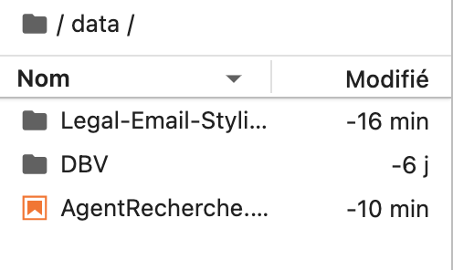
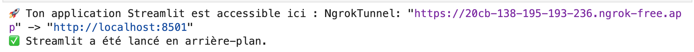

# Instructions pour faire fonctionner le code de l'équipe 3

Pour exécuter le projet, suivez les étapes suivantes : 
1. ### Importer les fichiers nécessaires sur myDocker:
  * **Base de données ChromaDB :** Nom du dossier **DBV** disponible à cette adresse → [Base de donnée vectorisée](https://drive.google.com/drive/folders/1-v_M7ytIl5hwlpKsJT0vGihV94qpCZvi?usp=sharing).
  * Dossier ```Legal-Email-Styling-app_dev``` : contenant les différents fichiers nécessaires pour l'interface.
  * Fichier ```AgentRecherche.ipynb``` : permettant de déployer temporairement l'interface Streamlit sur un serveur *ngrok*.  

  Une fois importés, votre arborescence sur **myDocker** devrait ressembler à ceci :



2. ### Exécuter le code   
Le code ne nécessite normalement aucune modification. Il suffit d’exécuter les cellules du fichier ```AgentRecherche.ipynb```, ce qui générera un lien *ngrok*, par exemple :

   

  En cliquant sur ce lien, l’interface s’ouvrira, permettant ainsi de tester les fonctionnalités développées par l’équipe 3.

✅ **Fonctionnalités disponibles :**    
Seules les sections suivantes sont opérationnelles :

* **Home**
* **Dashboard**
* **Chatbot**   
Les autres parties de l’interface appartiennent aux autres équipes et ne sont pas fonctionnelles dans ce projet.

⚠️ **À noter :**    
*Pour le chatbot, un temps d’attente est à prévoir lors de la première requête. En effet, la base de données vectorisée étant volumineuse, son chargement initial et la configuration des premiers paramètres peuvent prendre quelques instants. Cependant, l’utilisation devient plus fluide par la suite.*
